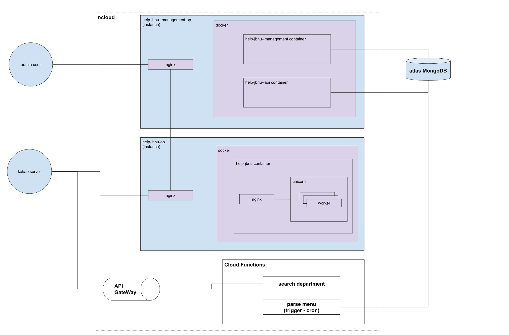

현 날짜 기준으로 알려줘전북대 인프라 구조이다.  
얼마전까진 aws에 있었으나 지금은 ncloud에 모두 넘어와있다.

이유는 크게 없고 그저 무료 크레딧이 사라지기 전에 어느정도 써보려고하는게 목적이다.  
아마 추후에는 gcp로 옮겨가게 될 것 같다. 이유는 역시 크레딧이다.

## 인프라 개요
2개의 인스턴스와 cloud functions에 2개의 함수를 두고 있다.
- help-jbnu-op
  - 메인이 되는 help-jbnu 앱이 들어 있는 인스턴스.
  - docker와 nginx가 설치되어있다.

- help-jbnu--management-op
  - admin 페이지를 담당하는 help-jbnu--management앱과  
    api를 담당하는 help-jbnu--api앱이 들어 있는 인스턴스.
  - 마찬가지로 docker와 nginx가 설치되어있다.

- cloud functions
  - lamda급으로 필요한 일부 함수들이 들어있다.
  - search department, parse memu가 알려줘전북대에서 쓰이고 있다.

- atlas mongodb
  - 서비스에 필요한 데이터들 및 admin에 필요한 데이터들을 담고 있는 db.
  - mongodb를 메인으로 사용하며 atlas를 사용하고 있다.

## 앱 개요
- help-jbnu
  - 메인이 되는 앱으로 학과 검색을 제외한 카카오로부터 오는 모든 호출이 이 앱을 통해 들어왔다 나가게된다.
  - 초기에는 이 앱 하나로 모든 것을 하고 있었으나, 서비스를 해나가면서  
  메인이 되는 몇몇 기능들이 외부 앱으로 분리되었다.
  - 현재는 들어온 메세지를 어떤 목적인지 파싱하는 역할과 기타 사소한 기능들을
  바로 응답해주는 역할로 쓰고 있다.
  - 내부에 sqlite를 가지고 있어서 일부 데이터를 캐싱 느낌으로 직접 가지고 있다.
  - 사용 기술: ruby on rails
  
- help-jbnu--api
  - mongodb와 직접 연결된 앱으로 help-jbnu 앱에서 호출하는 api에 맞게 데이터를 넘겨주는 역할하고 있으며 사용자의 호출기록을 저장하는 역할도 하고 있다.
  - 초기에는 help-jbnu에 있던 기능이였으나 다음 두가지 이유로 외부 앱으로 분리가 되었다,
    - 첫째, nodejs를 사용하는 스텍으로 전체 앱을 변경할 계획이 있어 그것에 앞서 먼저 몇몇 기능들 단위를 api로 빼낸 것  
    - 둘째, 앱을 분리함으로써 api급의 기능이 업데이트 되어도 메인 앱은 재시작할 필요가 없게 하기 위함. 일종의 관심사 분리?
  - 사용 기술: nodejs

- help-jbnu--management
  - admin 페이지로 사용량, 호출 메세지, 각종 스위치등을 제어할 수 있는 앱.
  - jwt를 붙여 auth 기능이 붙어있다.
  - 추후에는 관리자에 권한 개념을 달아, 서브 관리자 기능을 추가할 예정.
  - 사용 기술: nodejs, react

- cloud functions
  - search department
    - 학과사무실 검색 기능을 담당하는 함수.
    - 카카오서버에서 직접 호출하는 함수로 api gateway에 연결되어 있다.
  - parse menu
    - 학과 메뉴들을 파싱해 db에 저장해주는 함수.
    - cloud functions trigger의 cron 옵션을 통해 설정한 매시간마다 호출된다.

## nginx와 docker
편한 배포와 무중단 그리고 보안을 위해 docker와 nginx를 사용하고 있다.  
- docker
  - 무료 크레딧을 찾아 여러 클라우드를 방황하는 나에게는 앱을 돌리기 위한 셋팅을 간단하게 만들 필요가 있었고, 그렇게 알게 된게 docker이다.
  - 업데이트시에도 주로 docker를 통해 다른 포트로 앱을 하나 띄운뒤 nginx에서 이를 교체하는 방식으로 하고 있다.
- nginx
  - 무중단과 리버스 프록시를 위해 사용하고 있다.
  - help-jbnu--management-op 인스턴스에는 앱이 두개가 띄워져있는데 이를 같은 포트에서 사용하기 위해 /api가 붙은 path로 요청이 올 경우에는 api 앱으로 그렇지 않을 경우에는 management 앱으로 가도록 되어있다.
  - 그 외에 help-jbnu--api 앱은 호출하는 대상이 한정되어 있으므로  
  특정 ip에서만 호출가능하도록 설정을 추가할 예정이다.