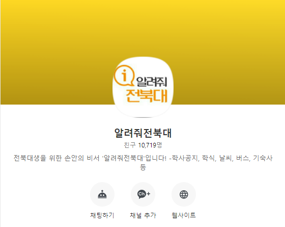
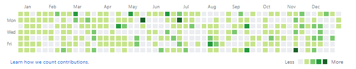

올해도 어김없이 1월이 되고 작년인 2019년 회고를 써보고자한다.

**알려줘전북대**

이번에도 첫번째 순서는 역시나 알려줘전북대이다.   
지금보니 10700명정도 되었다. 작년 회고 기준으로 대략 3000명정도 늘어난건데 학교 일정에 대해서 처리를 따로 신경을 써주고 있지않다보니 아무래도 늘어나는 폭이 살짝 줄어든게 아닐까하고 생각해본다.

2019년 알려줘전북대에는 인프라적인 요소가 많이 변경되었는데  
그 중 하나는 nginx의 추가이다.  
이로 인해 무중단 배포가 가능해지고 여러 앱을 띄워 리소스를 분산시킬 수도 있게 되었다. 

사실 이미 core 앱 자체는 N개의 프로세스를 nginx로 묶여서 제공하고 있긴했지만  
저걸 만들 당시에는 nginx에 대한 개념이 거의 없었고 설정 코드를 복사해와서 사용하는 수준이였는데  
지금은 nginx config 파일을 직접 작성해서 사용할 수 있게 되었다.  

변경된 구조는 [[blog.minung.dev] 알려줘전북대 구조](https://blog.minung.dev/2019-07-22/%EC%95%8C%EB%A0%A4%EC%A4%98%EC%A0%84%EB%B6%81%EB%8C%80-%EA%B5%AC%EC%A1%B0)에 간단하게 적어두었는데 지금은 또 변경되었기 때문에 이에 관련된 글은 조만간 작성할 예정이다.

두번째 큰 변화는 알려줘전북대 가장 앞단에 proxy라는 앱을 추가한 것이다.  
[LetMeKnow.jbnu--proxy](https://github.com/hmu332233/LetMeKnow.jbnu--proxy)라는 repo가 추가되었고 node 기반의 앱이다.  

이를 추가한 가장 큰 이유는 알려줘전북대 서비스의 클라이언트가 카카오톡뿐이였는데 구글 어시스턴트나 빅스비 또는 외부 api로써 확장될 가능성이 생겨서 이를 한 곳에서 통제할 gateway가 필요했다.  
그리고 일부 api들이 외부 api를 사용하고 있어서 해당 api에서 log를 기록하도록 별도로 추가했었는데 이제는 모든 api가 gateway를 통해 지나다니면서 log를 쌓기에도 편해지게되었다.  
계획으로는 특정 기능의 on/off, 특정 유저, ip block, token 기반 인증등을 생각하고 있다.
gateway라는 말이 자주 나오는데 이 앱의 이름을 proxy와 gateway 중에 고민을 했었는데 결국 proxy로 지었다. 이유는 gateway 외의 역할을 더 시킬 것 같아서?

세번째 변화라기에는 조금 작은 변화이긴한데 학과사무실 정보 검색 기능이 lambda api로 별도로 빠져나왔다. 이것은 2018년 회고에 예고(?)했던대로 일부 기능을 별도의 앱들로 분리하는 과정 중에 하나인데 이 과정에서 gateway나 security group과 같은 지식들을 얻었다. 요즘은 주로 ncloud를 사용 중인데 ncloud에서는 ACG라는 기능으로 있는 것 같다. 다만 aws보다 기능이 부족한 느낌?

기술적인 변화는 위와 같고 무엇보다 가장 큰 사건은
알려줘전북대에 첫 컨트리뷰터가 등장했다는 것이다!  
내 버킷리스트 중 하나가 내가 만든 오픈소스에 누군가가 컨트리뷰터로써 참여하는 것이였는데 그게 2019년에 이루어졌다.

[알려줘전북대 중앙 repo](https://github.com/hmu332233/LetMeKnow.jbnu)도 생겼고 컨트리뷰터를 표시하는 섹션도 만들었다.

첫 컨트리뷰터의 등장으로 프로젝트에 협업 관련한 셋팅을 추가하게 되었는데
그 과정에서 jest, prettier 등의 툴과 이를 자동화하는데 쓰는 husky, lint-staged 등을 추가로 사용하게 되었다.  
협업을 위한 자동화의 수단으로 도입하게 되었으나 사용하다보니 매우 편해서 그 이후에 만들어진 개인 프로젝트들에 모두 적용하고 있다.  

이제는 알려줘전북대를 확장한 서비스를 가져보고자한다.  
사용자들을 흡수 할 수 있도록 서비스를 만들 예정이고 이미 진행 중에 있다.  
3월 개강 전에 오픈을 하는 것을 목표로 잡았는데 계속해서 몰려오는 귀찮음에 밀려나고 있다 ㅠㅠ.  
이번 연휴에 어느정도 완성을 할 수 있으면 좋겠다.

**일일커밋 근황**

2019년에는 더이상 일일커밋을 하지 않게되었다.  
점점 커밋을 위한 커밋을 하는 것 같아 일일커밋의 의미가 없어짐을 느껴서 일일커밋을 의무화하지는 않고 그저 내가 개발하고 싶을 때 개발하기로 했다.  
그래서인지 잔디밭이 많이 줄어들었지만 나쁘지않다고 생각한다.
아 또한 인프라 관련해서 이것저것 해보다보니 커밋을 하지 않게 된 것도 있다.

**컨트리뷰션**

작년에 goormide 홍보용 PR이 머지된 이후 작은 오픈소스라도 머지가 되는 것을 목표로 했었는데
올 해는 2개의 오픈소스에 머지가 될 수 있었다.

- [ko.reactjs.org](https://github.com/reactjs/ko.reactjs.org)
- [vim-cheat-sheet](https://github.com/rtorr/vim-cheat-sheet)

번역을 노리고 한 것은 아니지만 둘 다 번역 PR이게 되었다.  
react 공식 문서는 한 때 붐처럼 수많은 사람들이 달려들어서 나도 그들 중 하나가 되어 한 페이지를 맡아서 번역을 했다. 지금은 반영이 되어있다.  
vim 문서는 학과 선배이자 직장 동료인 형이 일부 번역이 누락되어있음을 알려줘서 나에게 PR 올려보라고 권해주었고 번역해서 PR을 올렸더니 머지가 되었다 ㅋㅋ  
2020년에는 작은 소스코드라고 수정한 PR이 머지가 되는걸 목표로 삼아야겠다.

**기억에 남는 사이드 프로젝트들**

올해도 어김없이 수많은 사이드 프로젝트들을 진행했는데
그 중 추후에 완성을 하고 싶은 프로젝트만 적어보려한다.

- [kakao_json_builder](https://github.com/hmu332233/kakao_json_builder)  
  카카오 채널 응답 타입 JSON 빌더이다.
  카카오 채널 봇을 사용할 때 json으로 말풍선을 만들어 낼 수 있는데    
  빌더 UI를 통해서 응답 json을 만들어내거나 반대로 json을 통해 말풍선이 어떻게 보이는지 확인할 수 있게 해주는 서비스이다.    
  아마 미리보기까지 구현하고 멈춘 것으로 기억하는데
  2020년에는 완성해서 배포를 해볼까 계획 중이다.

- [chrome_extension.goormide-tools](https://github.com/hmu332233/chrome_extension.goormide-tools)  
  구름IDE에 기능을 추가해주는 크롬 익스텐션.  
  나만의 기능으로 쓰고 있었는데 최근에 정식 기능으로도 추가되어서 사실 의미가 없어지긴했다.
  크롬 웹스토어에 정식으로 올렸으나 한번 거절 당한 이후로 의욕을 잃고 더 고치고 있지는 않다.

- [LetMeKnow.jbnu--bixby](https://github.com/hmu332233/LetMeKnow.jbnu--bixby)  
  알려줘전북대 빅스비 버전.  
  이 친구도 한번 정식으로 올렸는데 수정 요청과 함께 거절당하고 이후 수정을 하지 않아 멈춰있는 상태이다.  
  언젠가는 재시도를 하겠지만 아직은 계획에 없다.

- [jbnu-calendar](https://github.com/hmu332233/jbnu-calendar)   
  학교 모든 일정을 모아볼 수 있는 캘린더를 만드는게 목표.  
  최근 그나마 진행 중인 사이드 프로젝트이다.  
  1월까지 완성하고 2월에는 데이터를 모아서 3월에는 오픈하는데 목표이고 
  그 이후에는 각 학생회 같은 곳에서 일정을 스스로 등록하게 할 수 있게 하면 알아서 잘 돌아가지 않을까하고 생각하고 있다.

- [react-component-magnifier](https://github.com/hmu332233/react-component-magnifier)  
  react로 감싸면 마우스가 가는 곳에 컴포넌트를 확대해서 보여주는 컴포넌트.  
  개발자 행사를 갔다가 발표 중 돋보기 기능에 대해 이야기를 듣던 도중
  갑자기 만들어봐야겠다 라고 생각해서 만들었다.
  이것도 완성은 하지 않고 끝냈는데 2020년에 완성해서 올려봐야지..

**그 외 활동**

올해는 뭔가 네이버에 관련된 세미나나 행사에 주로 다녀왔는데  
기억에 남는건 역시 처음 가본 Deview였다. nhn forward보다는 내 기술스텍과 비슷한 주제가 더 많아서 좀 더 기억에 남는 행사인 것 같다.

graphql을 살짝 공부해봤다. 개념과 간단한 실습정도만 해봤는데 올 해는 이걸로 api 서버를 하나 만들어보는 프로젝트를 하나쯤은 해봐야겠다.

아 react hooks가 정식으로 등장하고 매우 잘 쓰고 있다.  
react도 사용을 시작한지 벌써 약 2년이 되고 있는데  
아마 21년의 내가 보면 이런 헛소리를 적어놨다는 것에 머리를 쥐어잡을 수도 있겠지만 뭔가 이제서야 react에 대한 감이 조금은 오는 느낌이다.

**마무리**

올해는 2018년의 회고와 비슷한 형식으로 적어보았다.  
정리를 하고보니 새로 시작한 사이드프로젝트 중 완성을 한게 하나도 없다는 것을 알게되었는데 올 해에는 이것들을 모두 완성해보는 것으로 목표를 잡고자 한다.

요즘은 제너럴리스트와 스페셜리스트 사이에서 고민에 빠져있다.  
2020년의 경험이 이 고민을 해결해 줄 수 있으면 좋겠다.  
올 해도 잘 부탁드립니다. 2020님!